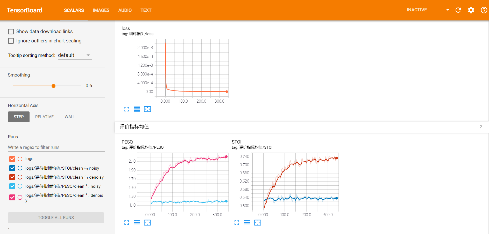
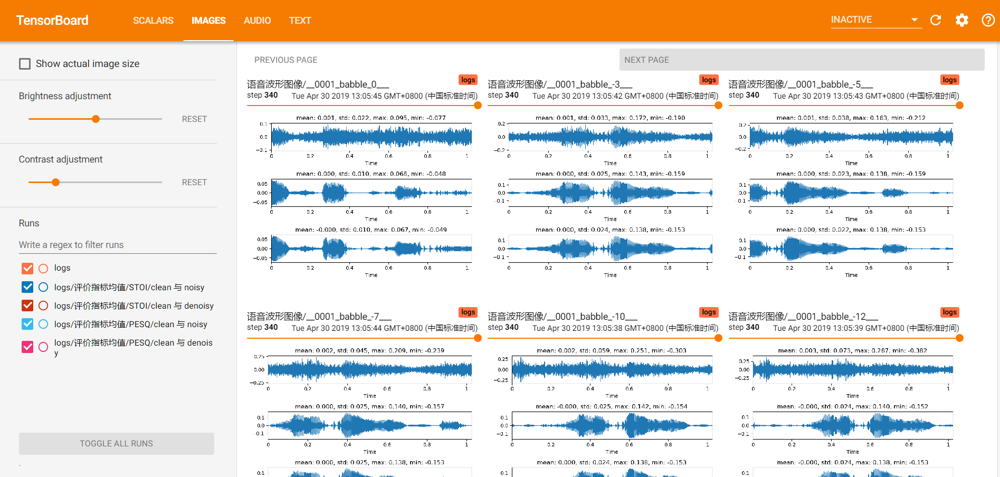

# Wave-U-Net-for-Speech-Enhancement

Implement [Wave-U-Net](https://arxiv.org/abs/1806.03185) by PyTorch, and migrate it to the speech enhancement area.




## 依赖

- librosa
- tqdm
- Pytorch >= 1.0
- joblib
- tensorboardX

## Usage

### Train

使用 -C 参数指定训练所用的配置文件，参考 `config/train/train.json`，使用 -D 所用的 GPU 编号，比如 `-D 1,2` 表示使用第二块和第三块 GPU

```bash
python train.py -C <training_json_file_in_config_dir> -D <GPU_ids, e.g. 1,2>
```

### Test

```bash
ToDo Contains unhandled bugs.
```

### Visualization

用于可视化的数据存储 `train.json: <save_location><name><logs>` 中，可以使用 tensorboardX 进行可视化：

```bash
tensorboard --logdir <train.json: <save_location><name><logs> [--port <port>]
```


## ToDo

- [x] Separate computing metrics from test script
- [x] Add period for visualization of validation set
- [x] Extract layers and channels_interval to config file
- [x] Change npy format to pkl format and load datasets up 20 times faster
- [x] Extract params from the training and test scripts